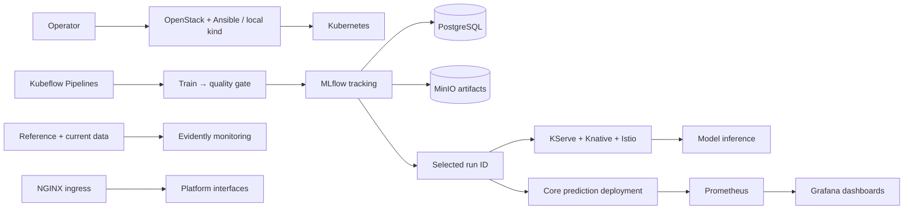

# Kubernetes MLOps Platform

[](https://github.com/VillaforTech/kubernetes-mlops-platform/actions/workflows/checks.yml)

**Track experiments. Run pipelines. Serve versioned models. Observe the system.**

A reproducible Kubernetes platform that connects MLflow, Kubeflow Pipelines,
KServe, Evidently, Prometheus, and Grafana. It includes local and remote
provisioning, persistent metadata and artifact storage, access controls, and
executable demonstrations of the model lifecycle.

[Architecture](docs/architecture.md) · [Capabilities](docs/capabilities.md) ·
[Operations](docs/operations.md) · [Validation](docs/validation.md) ·
[Case study](docs/case-study.md)

## Platform



The demo uses Iris to make the infrastructure easy to verify. The contribution is
the system around the model: artifact lineage, execution boundaries, quality
gates, serving, observability, and repeatable operations.

| Capability | Implementation |
| --- | --- |
| Provisioning | Local kind; OpenStack VM and Ansible configuration |
| Experiment tracking | MLflow backed by PostgreSQL and MinIO |
| ML workflows | Kubeflow pipeline with tracked training and an explicit quality gate |
| Model serving | KServe InferenceService with Knative autoscaling and Istio routing |
| Input monitoring | Evidently workspace and a reproducible drift snapshot |
| System monitoring | Prometheus scrape targets and provisioned Grafana dashboards |
| Access | NGINX routes, read-only observer roles, scoped kubeconfig and local credentials |
| Verification | Unit tests, manifest policies, smoke tests, full-platform checks, CI |

## Quick start

Prerequisites: Python 3.11, Docker, kind, kubectl, Helm, Git, and Make. The full
stack is intended for a machine with **16 GiB available to the container engine**;
the core profile can run with 6–8 GiB. The tested versions and actual observations
are listed in the [validation record](docs/validation.md). Some upstream Kubeflow
components require amd64 emulation on ARM hosts. Docker Desktop supplied that
compatibility in the recorded local test.

```bash
git clone https://github.com/VillaforTech/kubernetes-mlops-platform.git
cd kubernetes-mlops-platform
python3.11 -m venv .venv
. .venv/bin/activate
python -m pip install --require-hashes -r requirements.lock
python -m pip install --no-deps -e .

mlops doctor
mlops up           # cluster, image, storage, tracking, monitoring
mlops full         # Kubeflow, KServe dependencies, ingress and RBAC
mlops pipeline     # train in Kubeflow; enforce the quality gate; select a run
mlops serve        # serve that exact run through KServe
mlops verify-full  # check inference, artifacts, metrics, monitoring and access
```

For a shorter local check, `mlops demo` runs training as a Kubernetes Job and
serves the selected run through the prediction API. This supplements the full
workflow; it does not replace Kubeflow or KServe.

Runtime state, credentials, kubeconfig, and evidence stay in the ignored `.local/`
directory. Commands use a dedicated `kind-mlops-platform` context and verify node
ownership before changing the cluster. Services are ClusterIP; browser access
uses loopback port-forwarding. See [operations](docs/operations.md).

## Verify the repository

```bash
python -m pip install pytest==8.4.2 httpx==0.28.1 ruff==0.12.12
make check
```

`make check` runs lint, regression tests, Kustomize rendering, workload policies,
and local documentation links. It does not provision a VM or access a cluster.
Runtime checks are explicit commands, and their evidence is recorded separately.

## Layout

```text
src/mlops_platform/   CLI, training, prediction API, pipelines and monitoring
k8s/                 Core manifests and provisioned monitoring configuration
platform/            Full-stack versions, pipelines, serving, ingress and RBAC
infra/               kind topology, training Job, OpenStack and Ansible
tests/              Offline behavior and lifecycle tests
tools/              Manifest validation and user access utilities
docs/               Architecture, decisions, operations, evidence and case study
```

## Scope

This is an inspectable development platform. It uses single-replica storage and
a local cluster, with no claim of host-level high availability or production
multi-tenancy. Production operation would require authenticated ingress, TLS,
backups, recovery testing, and environment-specific capacity planning.

[Security](SECURITY.md) · [Support](SUPPORT.md) · [Contributing](CONTRIBUTING.md) ·
[MIT license](LICENSE) · [Third-party components](THIRD_PARTY.md)
